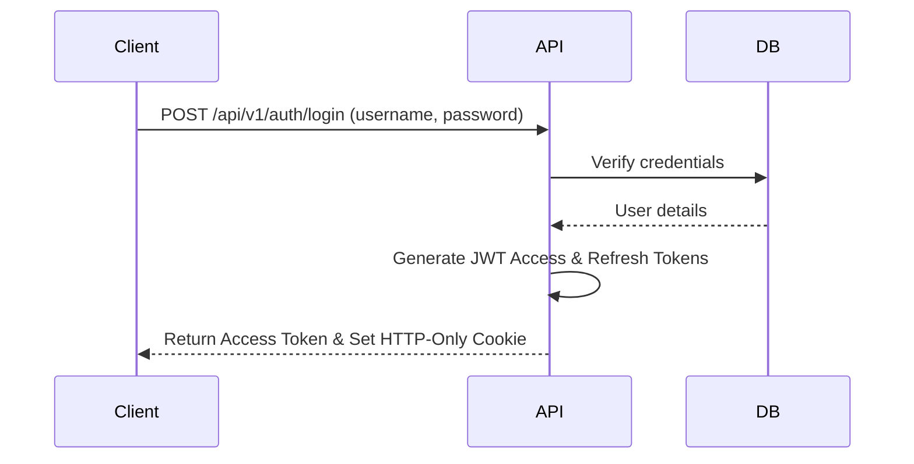
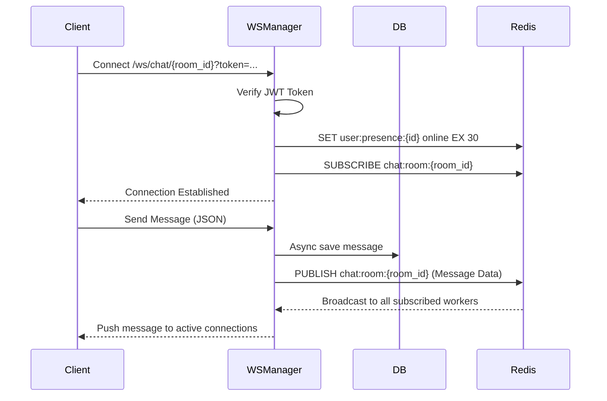

# BaatCheet — Data Flow & Flowcharts

## Authentication Flow

```mermaid
sequenceDiagram
    participant Client
    participant API
    participant DB
    
    Client->>API: POST /api/v1/auth/login (username, password)
    API->>DB: Verify credentials
    DB-->>API: User details
    API->>API: Generate JWT Access & Refresh Tokens
    API-->>Client: Return Access Token & Set HTTP-Only Cookie
```

## WebSocket Connection & Messaging Flow

```mermaid
sequenceDiagram
    participant Client
    participant WSManager
    participant DB
    participant Redis
    
    Client->>WSManager: Connect /ws/chat/{room_id}?token=...
    WSManager->>WSManager: Verify JWT Token
    WSManager->>Redis: SET user:presence:{id} online EX 30
    WSManager->>Redis: SUBSCRIBE chat:room:{room_id}
    WSManager-->>Client: Connection Established
    
    Client->>WSManager: Send Message (JSON)
    WSManager->>DB: Async save message
    WSManager->>Redis: PUBLISH chat:room:{room_id} (Message Data)
    Redis-->>WSManager: Broadcast to all subscribed workers
    WSManager-->>Client: Push message to active connections
```
